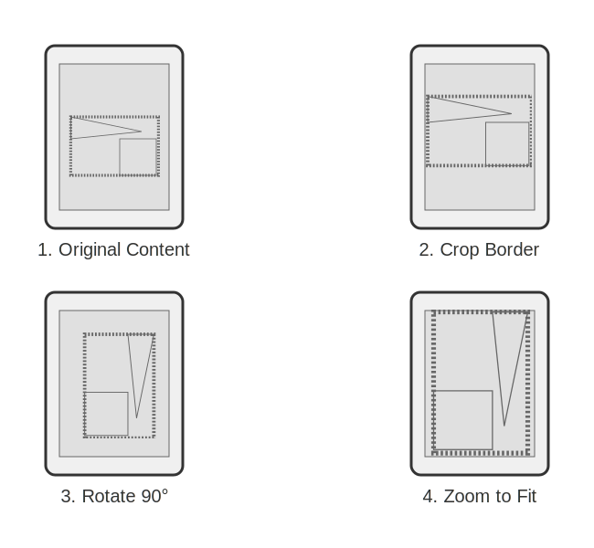

# Epub Optimizer for Small E-Ink Readers

This Python project aims to optimize EPUB files containing technical content with numerous images (tables, diagrams, etc.) for small e-ink readers (around 7 inches) that may have limited or poor e-book reading software. The primary focus of the optimization is on image transformation to improve readability on these devices.

## ⚠️ Disclaimer: Tested Device

This software has primarily been tested and verified for functionality on the **Kobo Aura H2O 1st edition**. While it may work on other devices, its performance and effectiveness are not guaranteed beyond the tested hardware.

## How it Works

This optimizer specifically targets **images** within EPUB files. SVG images are currently not addressed as they are not deemed necessary for the intended optimization scope. The following transformations are applied to images:

1.  **Cropping:**
    * Where feasible, images are  cropped to remove large empty or blank areas. This reduces unnecessary whitespace around the core content of the image, allowing the relevant parts to be displayed larger and more clearly.

1.  **Rotation for Optimal Viewing:**
    * If an image's longest side in its original orientation aligns with the *shortest* side of the target device's screen (e.g., a landscape image on a portrait-oriented device), the image is rotated 90 degrees. This ensures the image is displayed in the most suitable orientation for the device's aspect ratio.

1.  **Maximum Zoom to Fit:**
    * Images are automatically zoomed as much as possible to ensure their shortest side fits the shortest dimension of the device's screen. This maximizes the image's display size without requiring horizontal scrolling.




## Features
* **Optimizes images:** Specifically targets images (excluding `svg`) within EPUBs.
* **Rotates images for best fit:** Automatically rotates images to match device orientation.
* **Maximizes image display size:** Zooms images to fill the screen's shortest dimension.
* **Removes blank areas:** Crops images to eliminate unnecessary whitespace.
* **Aimed at small e-ink readers:** Designed for devices with screens around 7 inches, i should say probably less than 10.
* **Improves readability of technical content:** Enhances the viewing experience for diagrams, tables, and charts.

## Installation

To install this software you could follow these steps:

```bash
git clone [https://github.com/vitorz/epub-optimizer.git](https://github.com/your-username/epub-optimizer.git)
cd epub-optimizer
pip install -r requirements.txt
```

---

## 🚀 Quick Start

1. Write a configuration file, call it `config.ini` and put it under `~/.config/epub-optimizer/`. It should contain the devices name you want optimize your epub for and the resolution of every device in a typical `.ini` format like this:

    ```source
    [KOBO AURA H2O]
    resolution = 1040x1350
    [Whatever additional device]
    resolution = 1100x1400
    ```
    
    Take into account that epub viewer software could apply some margins diplaying picture, so the resolution to write in this file is not the actual device screen resolution, but one which should include the applied margins.

1. To run the project, try this command (see all the available options through `--help`)

    ```bash
    python ebook.py -d "KOBO AURA H2O" "~/Calibre Library/Domain-Driven Design with Java.epub" ~/opt-epub/ddd-java.epub
    ```

    You can avoid to provide the `-d/--device` option if your `config.ini` contains only a single device.

---

## 📝 License

This project is licensed under the [MIT License](LICENSE).

---

## ⚠️ Disclaimer

> This software is provided **"as is"**, without any express or implied warranties.  
> The authors are **not responsible** for any data loss, misuse, or security issues.  
> Use it **at your own risk**, only within trusted local environments.
